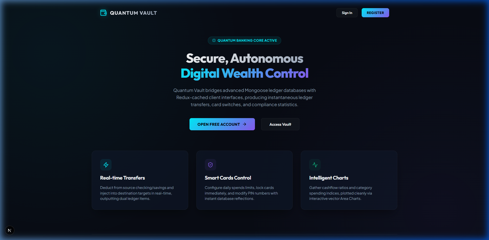
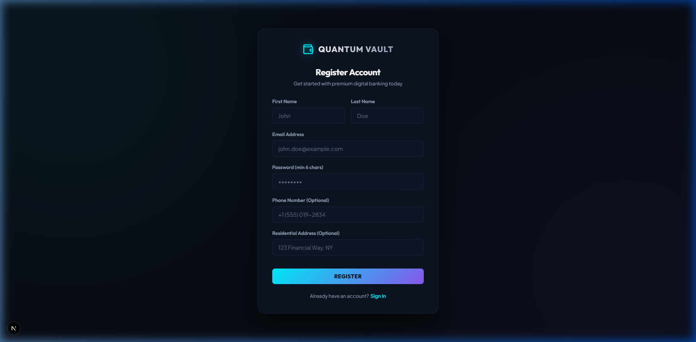
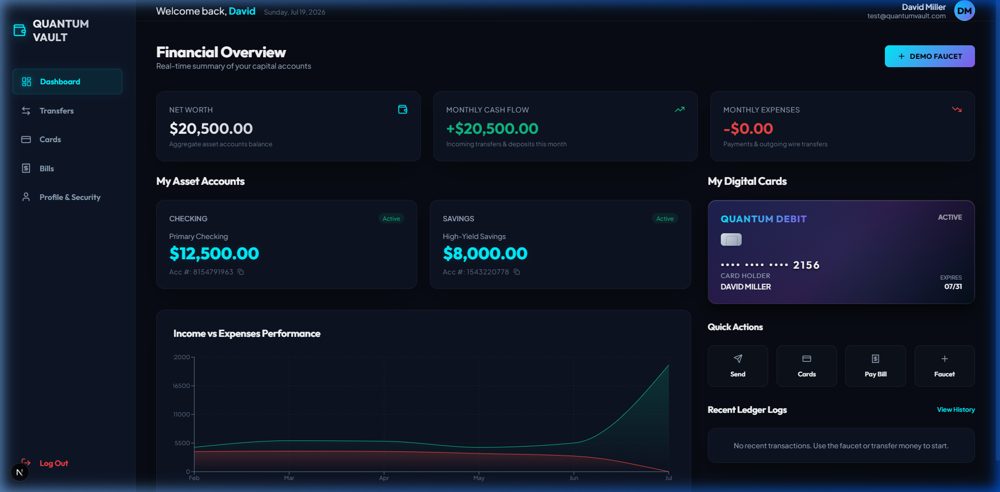
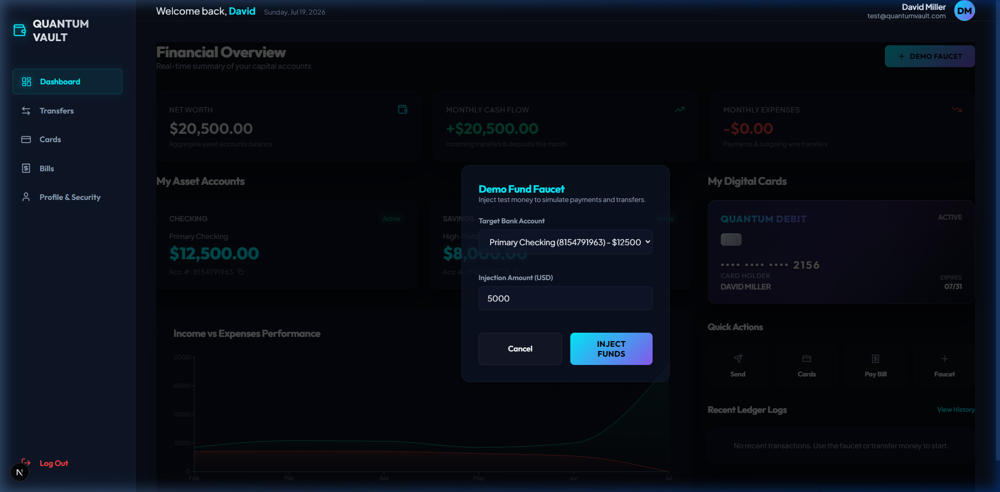
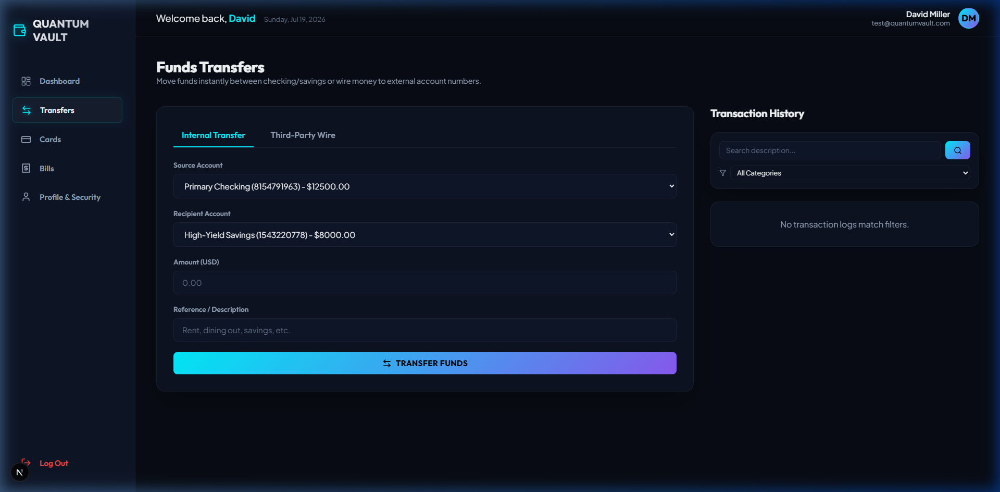
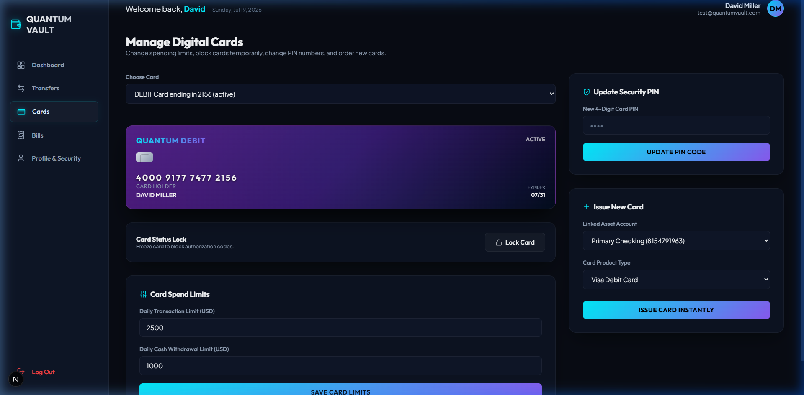
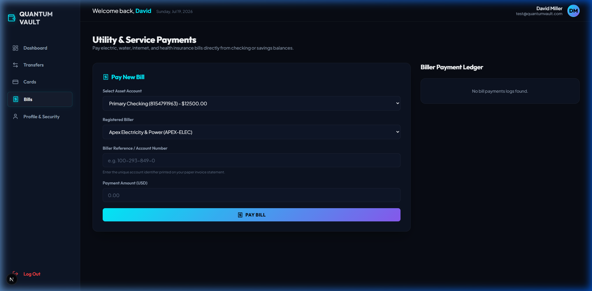
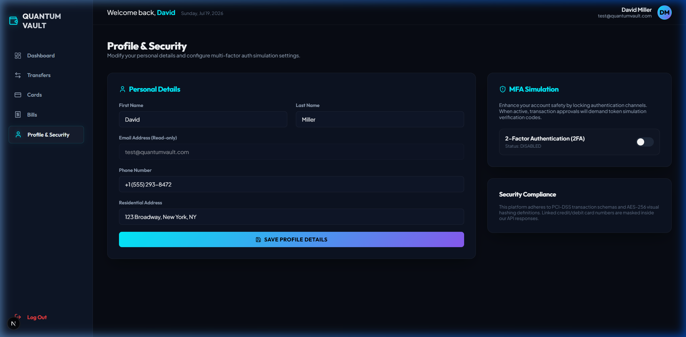
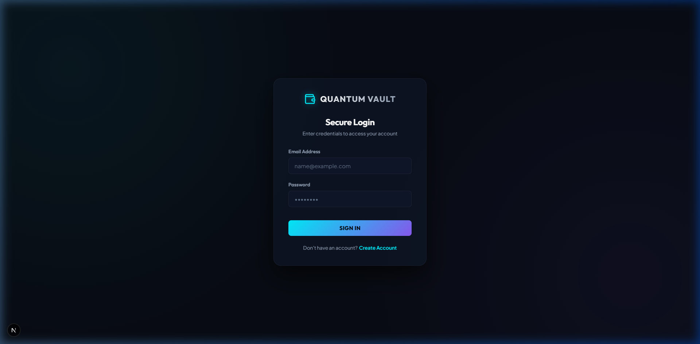

# Quantum Vault - Next-Generation Digital Banking Platform

Quantum Vault is a premium full-stack online banking system built with a modular NestJS backend, MongoDB integration (via Mongoose), and a Next.js (App Router) client frontend. It implements standard banking workflows (transfers, card controls, utility bill payments, and spending statistics) under a state-of-the-art dark glassmorphic styling system using Vanilla CSS.

To guarantee zero-friction local development, the backend automatically spins up an in-process, self-contained MongoDB server (`mongodb-memory-server`) on startup if no external database is configured.

---

## Technical Stack & Architecture

### Backend (`/backend`)
- **Framework**: NestJS (TypeScript)
- **Database ORM**: Mongoose / MongoDB
- **Autonomic Database**: `mongodb-memory-server` (starts automatically in development mode)
- **Authentication**: JWT token authorization guards (`passport-jwt`) and secure password hashing (`bcrypt`)

### Frontend (`/frontend`)
- **Framework**: Next.js App Router (React 19, TypeScript)
- **State & Cache**: Redux Toolkit (auth, accounts, transactions, cards, and bills slices)
- **Data Visualization**: Recharts (smooth vector Cashflow area charts)
- **Icons**: Lucide React
- **Styling**: Pure Vanilla CSS and CSS Modules (Outfit & Plus Jakarta Sans typography, neon glow gradients, and backdrop blurs)

---

## Screenshots & Page Walkthrough

### 1. Landing Page
An overview landing page presenting the core platform benefits (real-time wires, visual card limits, category spend indices).



### 2. User Onboarding (Registration)
Standard registration form. Upon signup, the backend automáticamente provisions a Checking account ($12,500), a Savings account ($8,000), and an active visual Debit card.



### 3. Client Dashboard
The core control panel. Displays aggregate asset accounts, real-time balances, copyable account numbers, virtual card, recent ledger events, and a 6-month historical Area chart representing cash flow.



### 4. Demo Fund Faucet
An inline overlay modal allowing users to inject test money into checking or savings, recording immediate database deposit ledgers.



### 5. Funds Transfers
Wire money between owned accounts (internal checking/savings) or send funds to any external user's 10-digit account number. Includes category filter dropdowns and description search on the transaction list.



### 6. Card Control Center
Visual credit/debit card cards. Toggle freezing cards to block transaction codes. Update daily purchase/ATM withdrawal limits and change PIN numbers instantly.



### 7. Bill Payments
Pay electricity, water, internet, and health insurance bills directly. Select from registered billers and log reference billing invoice payments.



### 8. Profile & Security
Review personal profile details, modify contact info, and simulate 2-Factor Authentication (2FA) switches.



### 9. Secure Login
Secure login gateway validating active JWT sessions.



---

## Local Setup & Installation

### Prerequisite
Ensure [Node.js](https://nodejs.org) is installed on your computer.

### Step 1: Configure Environment Files
Both projects have standard configuration files set up:

#### Backend (`/backend/.env`)
```env
MONGO_URI=mongodb://localhost:27017/online_banking
JWT_SECRET=super-secret-key-123456789-quantum-banking
JWT_EXPIRY=24h
PORT=4000
```
*(If no MongoDB service is running on port 27017, the backend automatically uses an in-memory MongoDB runner).*

#### Frontend (`/frontend/.env.local`)
```env
NEXT_PUBLIC_API_URL=http://localhost:4000
```

### Step 2: Spin Up NestJS Backend
```bash
cd backend
npm run start
```
The NestJS server will start on [http://localhost:4000](http://localhost:4000).

### Step 3: Spin Up Next.js Frontend
```bash
cd frontend
npm run dev
```
The Next.js dev server will spin up on [http://localhost:3000](http://localhost:3000) (or [http://localhost:3001](http://localhost:3001) if port 3000 is occupied).
